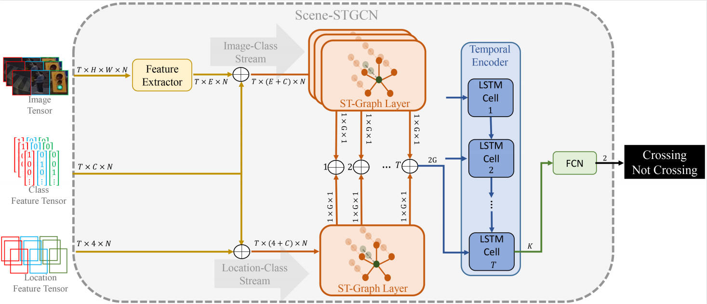

# Scene-STGCN

<p align="center">

</p>


This repository contains Python code and pretrained models for pedestrian intention estimation presented in our paper [**Abhilash Y. Naik, Ariyan Bighashdel, Pavol Jancura, and Gijs Dubbelman, "Scene Spatio-Temporal Graph Convolutional Network for Pedestrian
Intention Estimation".**]


### Table of contents
* [Dependencies](#dependencies)
* [PIE dataset](#datasets)
* [Train](#train)
* [Test](#test)
* [Reference](#citation)

<a name="dependencies"></a>
## Dependencies
The interface is written and tested on Ubuntu 18.04 with Python 3.8, Pytorch 1.8.1 CUDA 11.1 and cuDNN 8.0.5_0. The interface also requires
the following external libraries:<br/>

* scikit-learn
* numpy
* pillow
* prettytable
* ptable


<a name="datasets"></a>
## PIE Dataset
The code is trained and tested with [Pedestrian Intention Estimation (PIE) dataset](http://data.nvision2.eecs.yorku.ca/PIE_dataset/).

Download annotations from the [PIE webpage](http://data.nvision2.eecs.yorku.ca/PIE_dataset/) and place them in the `PIE_dataset` directory. The folder structure should look like this:

```
PIE_dataset
    annotations
        set01
        set02
        ...

```

Download the PIE clips and extract them as described in [PIE github](https://github.com/aras62/PIE).
```
images/set01/video_0001/
								00000.png
								00001.png
								...
images/set01/video_0002/
								00000.png
								00001.png
								...		
...
```

Videos will be automatically split into individual frames for training. This will require **1.1T** of free space on the hard drive.

<a name="train"></a>
## Train

To train all models from scratch for the first time use this command:
```
python main.py --train_test 0 --first_time True --image_path './images'
```

_Note: "--first_time=True" will create pickle file of all the objects from the image in data folder. It can take some hours to run for the first time. After the first run it is quick since it loads the pickle file.

To train all models from scratch after that use this command:
```
python main.py --train_test 0 --image_path './images'
```

<a name="test"></a>
## Test

To reproduce the results of our best model which combines traffic light and crosswalk for pedestrian intention prediction run this command: Download weights from [here](https://drive.google.com/drive/folders/10TrD2tgbRCkzTIKERhsnB7QKWRDh9kZs?usp=sharing)

```
python main.py 2 --weights_folder data/graph/intention/2objects
```

<a name="citation"></a>
## Reference
[PIE: A Large-Scale Dataset and Models for Pedestrian Intention Estimation and Trajectory Prediction](https://github.com/aras62/PIE)

